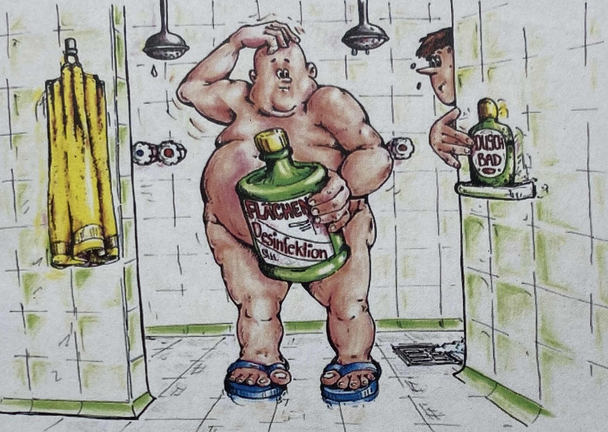

<!-- Section -->
<section>
	<header class="major">
		<h2>Unsere Leistungen</h2>
	</header>
	

		<article>
			
			<a href="beratung.html">

				<h3>Beratung</h3>
				<ul>
					<li>Biologische Arbeitsstoffe</li>
					<li>Potenziell infektiöses Material</li>
					<li>§ 35 Belehrung</li>
				</ul>
			
</a>
		</article>
		<article>
					
			<a href="schulung.html">

				<h3>Schulungen</h3>
				<ul>
                <li>KiTa / Kindergarten</li>
                <li>Schule</li>
                <li>Altenpflege</li>
                <li>Behinderteneinrichtungen</li>
                <li>Ambulante Pflege</li>
              </ul>
			
</a>
		</article>
		<article>
					
			<a href="gefahrenanalyse.html">

				<h3>Gefahrenanalyse</h3>
				
Individuelle Gefahrenanalyse zur Verhinderung von Covid19

			
</a>
		</article>
		<article>
		
			<a href="plan.html">

				<h3>Hygiene- /Desinfektionspläne</h3>
				<ul>
					<li>Hygienepläne nach dem fünf Punkte System</li>
					<li>Individuelle Desinfektionspl&auml;ne</li>
				</ul>
			
</a>
		</article>
		<article>
		
			<a href="schlussdesinfektion.html">

				<h3>Schlussdesinfektion bei Infektionsgeschehen</h3>
				
Durchf&uuml;hrung nach RKI-Richtlinien und Infektionsschutzgesetz

			
</a>
		</article>
	

</section>

<!-- Section -->
<section>
	<header class="major">
		<h2>Aktuelles</h2>
	</header>
	

		<article>
			
			<a href="https://experience.arcgis.com/experience/478220a4c454480e823b17327b2bf1d4" target="_blank"><h3>Aktuelles Covid19-Dashboard</h3></a>
			<ul class="actions">
				<li><a href="https://experience.arcgis.com/experience/478220a4c454480e823b17327b2bf1d4" class="button" target="_blank">Mehr</a></li>
			</ul>
		</article>
		<article>
			
			<h3>Gefahren durch Desinfektionsmittel</h3>
			<ul class="actions">
				<li><a href="https://www.fitbook.de/health/so-schaedlich-ist-desinfektionsgel-fuer-die-gesundheit" class="button" target="_blank">Mehr</a></li>
			</ul>
		</article>
	

</section>
