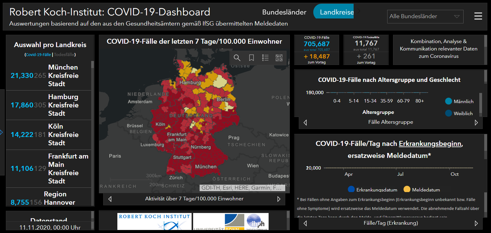

<!-- Section -->
<section>
	<header class="major">
		<h2>Unsere Leistungen</h2>
	</header>
	

		<article>
			
			<a href="beratung.html">

				<h3>Beratung</h3>
				<ul>
					<li>Biologische Arbeitsstoffe</li>
					<li>Potenziell infektiöses Material</li>
					<li>§ 35 Belehrung</li></a>
				</ul>
			

		</article>
		<article>
			
			<a href="schulungen.html">

				<h3>Schulungen</h3>
				<ul>
                <li>KiTa</li>
                <li>Kindergarten</li>
                <li>Schule</li>
                <li>Altenpflege</li>
                <li>Behinderteneinrichtungen</li>
                <li>Ambulante Pflege</li></a>
              </ul>
			

		</article>
		<article>
			
			<a href="gefahrenanalyse.html">

				<h3>Gefahrenanalyse</h3>
				
Aenean ornare velit lacus, ac varius enim lorem ullamcorper dolore. Proin aliquam facilisis ante interdum. Sed nulla amet lorem feugiat tempus aliquam.
</a>
			

		</article>
		<article>
			
			<a href="plan.html">

				<h3>Hygiene- /Desinfektionspläne</h3>
				
Aenean ornare velit lacus, ac varius enim lorem ullamcorper dolore. Proin aliquam facilisis ante interdum. Sed nulla amet lorem feugiat tempus aliquam.
</a>
			

		</article>
		<article>
			
			<a href="schlussdesinfektion.html">

				<h3>Schlussdesinfektion bei Infektionsgeschehen</h3>
				
Aenean ornare velit lacus, ac varius enim lorem ullamcorper dolore. Proin aliquam facilisis ante interdum. Sed nulla amet lorem feugiat tempus aliquam.
</a>
			

		</article>
	

</section>

<!-- Section -->
<section>
	<header class="major">
		<h2>Aktuelles</h2>
	</header>
	

		<article>
			
			<a href="https://experience.arcgis.com/experience/478220a4c454480e823b17327b2bf1d4" target="_blank"><h3>Aktuelles Covid19-Dashboard</h3></a>
			<ul class="actions">
				<li><a href="https://experience.arcgis.com/experience/478220a4c454480e823b17327b2bf1d4" class="button">Mehr</a></li>
			</ul>
		</article>
		<article>
			
			<h3>Nulla amet dolore</h3>
			
Aenean ornare velit lacus, ac varius enim lorem ullamcorper dolore. Proin aliquam facilisis ante interdum. Sed nulla amet lorem feugiat tempus aliquam.

			<ul class="actions">
				<li><a href="#" class="button">More</a></li>
			</ul>
		</article>
		<article>
			
			<h3>Tempus ullamcorper</h3>
			
Aenean ornare velit lacus, ac varius enim lorem ullamcorper dolore. Proin aliquam facilisis ante interdum. Sed nulla amet lorem feugiat tempus aliquam.

			<ul class="actions">
				<li><a href="#" class="button">More</a></li>
			</ul>
		</article>
		<article>
			
			<h3>Sed etiam facilis</h3>
			
Aenean ornare velit lacus, ac varius enim lorem ullamcorper dolore. Proin aliquam facilisis ante interdum. Sed nulla amet lorem feugiat tempus aliquam.

			<ul class="actions">
				<li><a href="#" class="button">More</a></li>
			</ul>
		</article>
		<article>
			
			<h3>Feugiat lorem aenean</h3>
			
Aenean ornare velit lacus, ac varius enim lorem ullamcorper dolore. Proin aliquam facilisis ante interdum. Sed nulla amet lorem feugiat tempus aliquam.

			<ul class="actions">
				<li><a href="#" class="button">More</a></li>
			</ul>
		</article>
		<article>
			
			<h3>Amet varius aliquam</h3>
			
Aenean ornare velit lacus, ac varius enim lorem ullamcorper dolore. Proin aliquam facilisis ante interdum. Sed nulla amet lorem feugiat tempus aliquam.

			<ul class="actions">
				<li><a href="#" class="button">More</a></li>
			</ul>
		</article>
	

</section>
